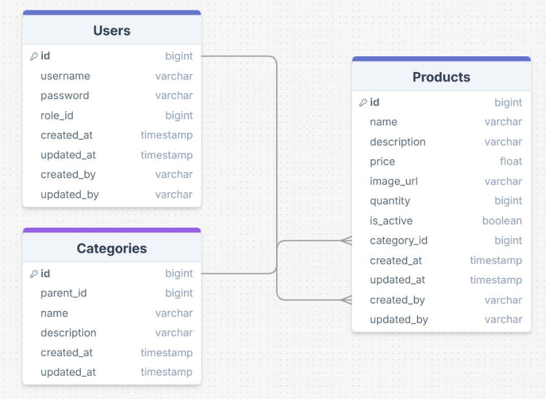

# 🛒 mymarket — FastAPI Backend

Welcome to the backend project of mymarket — a modern REST API built with FastAPI and PostgreSQL.

---

## 📌 Project Overview

mymarket is a clean and scalable backend application designed to manage users, products, categories, and orders. It provides secure JWT-based authentication and comes with full Docker support for quick deployment.

---

## 🛠️ Tech Stack

- 🐍 Python 3.11+
- ⚡ FastAPI
- 🐘 PostgreSQL
- 📦 SQLAlchemy
- 🔐 JWT Authentication
- 🔁 Alembic (database migrations)
- 🧪 Pytest
- 🐳 Docker & Docker Compose
- 🗃️ MinIO
---

## 🗃️ Database Schema

---
